# Invoice Intelligence

Invoice Intelligence is a Java/Spring Boot portfolio project that turns PDF invoices into structured invoice data while keeping document interpretation and business validation deliberately separate. It demonstrates backend reliability patterns around asynchronous AI work: transactional outbox publishing, at-least-once delivery, database-backed claiming, leases, retries, and fenced completion.

## Problem

Invoice documents are heterogeneous: some contain selectable text, others are scans, and extracted fields can be incomplete or inconsistent. A useful system needs more than an LLM call: it must process documents asynchronously, survive duplicate messages and worker failures, and make validation decisions deterministically.

## Key capabilities

- Accept PDF invoices and create asynchronous processing jobs.
- Extract native PDF text first, then fall back to OCR for scanned PDFs.
- Send normalized document text to an Ollama-backed LLM adapter for structured invoice extraction.
- Validate required fields, line items, subtotal arithmetic, tax-inclusive totals, and discrepancies in deterministic Java code.
- Persist `READY` invoices when validation is valid and `REVIEW_REQUIRED` invoices when the result needs human attention.
- Expose job status and allow explicit retry of terminally failed jobs.

## Architecture

The project is split into three practical boundaries:

- **Domain** owns the invoice model, processing lifecycle, validation rules, repository contracts, and outbox event model.
- **Application** coordinates use cases: submission, job creation, outbox publication, claiming, recovery, processing, and document orchestration. It depends on ports such as document storage, invoice extraction, event publishing, and processing ownership.
- **Infrastructure** adapts those ports to PostgreSQL/JPA, Kafka, local file storage, PDFBox, Tess4J/Tesseract, and Ollama over HTTP.

```mermaid
flowchart LR
    Client[HTTP client] --> API[DocumentController]
    API --> Submit[InvoiceProcessingService]
    Submit --> Storage[Local document storage]
    Submit --> Create[InvoiceJobCreationService]
    Create --> DB[(PostgreSQL\njobs + outbox)]

    DB --> Outbox[Outbox publishing poller]
    Outbox --> Kafka[(Kafka\ninvoice-processing)]
    Kafka --> Consumer[Kafka consumer]
    Consumer --> Claim[QueueManagementService\nclaim + lease]
    Claim --> DB
    Claim --> Worker[InvoiceProcessingWorker]

    Worker --> Storage
    Worker --> Docs[DocumentService]
    Docs --> PDF[PDF text extraction]
    PDF --> OCR[OCR fallback]
    OCR --> Normalize[Text normalization]
    Normalize --> LLM[Ollama adapter]
    LLM --> Validate[Deterministic validation]
    Validate --> Fence[Fenced completion]
    Fence --> DB
```



## End-to-end processing flow

1. `POST /api/v1/documents` validates and stores the uploaded PDF, then creates a `QUEUED` job and an `InvoiceProcessingRequested` outbox record in one database transaction.
2. In Kafka mode, the outbox poller publishes unpublished records to the `invoice-processing` topic and marks them published only after the send succeeds.
3. The Kafka consumer claims the requested job. The database claim changes the job to `PROCESSING`, sets a lease, and assigns a unique processing attempt ID.
4. The worker loads the stored document, extracts PDF text or uses OCR when the PDF has no usable text, normalizes the result, and calls the invoice-extraction port.
5. The Ollama adapter asks the configured model to return structured invoice JSON. Java maps that response into the domain model.
6. Deterministic validation decides whether the completed job becomes `READY` or `REVIEW_REQUIRED`.
7. Completion is accepted only when the stored processing attempt ID still matches the worker's claim. A late worker's result is discarded.

## Reliability decisions

**PostgreSQL is authoritative.** The database stores the durable job lifecycle, extracted invoice/validation JSON, lease, retry count, and attempt ID. Kafka delivers work; it does not decide the current state of an invoice.

**Transactional outbox prevents a split write.** A job and its processing-request event are persisted together. If the transaction rolls back, neither becomes visible. If Kafka is temporarily unavailable later, the unpublished event remains available for a later poll.

**Delivery is at least once by design.** An event can be sent again if publication succeeds but recording `publishedAt` fails. That is safe because workers claim from the authoritative job record rather than trusting message uniqueness.

**`FOR UPDATE SKIP LOCKED` makes competing workers cooperate.** Claim queries lock only an available queued row and skip rows another transaction owns, avoiding double claims without serializing the entire queue.

**Attempt IDs fence stale workers.** A recovered/reclaimed job receives a new attempt ID. Completion and retry/fail updates include that ID in their conditional update, so an earlier worker cannot overwrite newer state after a lease expiry.

**Leases recover abandoned work.** Processing jobs have a configured five-minute lease. The recovery poller requeues expired leases, while the request timeout is four minutes and Kafka's maximum poll interval is six minutes. Those bounds prevent an unbounded LLM request from quietly outliving its ownership window.

**Retry and failure are explicit.** Processing exceptions retry automatically up to the configured limit (three), then become `FAILED`. Kafka uses manual acknowledgment with auto-commit disabled: a retryable failure nacks the record for redelivery; completed, terminal, or stale work is acknowledged.

## AI and document pipeline

The LLM is used for **interpretation**, not business truth. It receives normalized text and returns candidate invoice fields: parties, dates, line items, taxes, and totals. The Ollama-specific HTTP client is an infrastructure adapter behind the application `InvoiceExtractor` port, so the application flow does not depend on Ollama APIs directly.

The document path is intentionally layered:

1. PDFBox reads embedded text.
2. If no usable text is present, PDF pages are rendered at 200 DPI and passed to Tesseract through Tess4J.
3. Whitespace and line endings are normalized before extraction.
4. Java validation checks the extracted result independently of the model.

The validator handles required invoice fields and line-item data, recalculates subtotal from quantity × unit price when possible, compares it with the stated subtotal, and compares the stated total with subtotal, taxes, and discount. The LLM is never allowed to make the final validity decision.

## Domain lifecycle and validation

```text
QUEUED → PROCESSING → READY
                    ↘ REVIEW_REQUIRED
                    ↘ FAILED → QUEUED  (explicit retry)
```

- `READY` means extraction completed and `InvoiceValidationResult` is `VALID`.
- `REVIEW_REQUIRED` means processing completed, but deterministic validation found missing or inconsistent information. It is not a processing failure.
- `FAILED` means the document-processing attempt exhausted automatic retries or otherwise reached terminal operational failure. The retry endpoint can requeue it.

## Technology stack

- Java 21 and Spring Boot
- Spring Web, Spring Data JPA, Spring Kafka, Spring scheduling
- PostgreSQL with Hibernate/JPA and JSONB columns
- Apache Kafka
- Apache PDFBox 3
- Tess4J / Tesseract OCR
- Ollama via Spring `RestClient`
- Jackson, Gradle, JUnit 5, Mockito, AssertJ, Awaitility

## Local setup

The application itself is not Dockerized. The repository provides Docker Compose only for Kafka.

### Prerequisites

- Java 21
- PostgreSQL listening on `localhost:5432`
- Docker, for the provided Kafka broker
- Ollama with the configured model
- Tesseract language data containing `eng.traineddata`

Create the database expected by `src/main/resources/application.yml`:

```bash
psql -U postgres -d postgres -c "CREATE ROLE invoice LOGIN PASSWORD 'invoice';"
psql -U postgres -d postgres -c "CREATE DATABASE invoice_intelligence OWNER invoice;"
```

Start Kafka:

```bash
docker compose -f docker/kafka/compose.yml up -d
```

Start Ollama, then pull the configured model from a second terminal:

```bash
# terminal 1
ollama serve

# terminal 2
ollama pull gemma3:12b
```

Point the application at Tesseract's data directory—the directory that contains `eng.traineddata`:

```bash
export TESSDATA_PREFIX=/path/to/tessdata
```

Run the application:

```bash
./gradlew bootRun
```

Current defaults are PostgreSQL `jdbc:postgresql://localhost:5432/invoice_intelligence`, Kafka `localhost:9092`, Ollama `http://localhost:11434`, processing mode `kafka`, and HTTP port `8080`. Properties can be overridden using normal Spring configuration.

## Example API usage

Create an asynchronous processing job from a PDF:

```bash
curl -X POST http://localhost:8080/api/v1/documents \
  -F "file=@/absolute/path/to/invoice.pdf;type=application/pdf"
```

Response (`202 Accepted`):

```json
{
  "jobId": "<uuid>"
}
```

Read the current job state:

```bash
curl http://localhost:8080/api/v1/documents/<uuid>
```

The response contains `jobId`, `status`, `invoice`, `validation`, `createdAt`, and `updatedAt`. A completed validation issue is returned in `validation.issues`; a job may therefore be `REVIEW_REQUIRED` with persisted extraction data rather than `FAILED`.

Retry a terminally failed job:

```bash
curl -X POST http://localhost:8080/api/v1/documents/<uuid>/retry
```

This returns `202 Accepted`. Retrying a job that is not `FAILED` returns `409 Conflict`; an unknown job returns `404 Not Found`.

For synchronous inspection endpoints, the controller also exposes:

```bash
curl -X POST http://localhost:8080/api/v1/documents/extract-text \
  -F "file=@/absolute/path/to/invoice.pdf"

curl -X POST http://localhost:8080/api/v1/documents/extract-invoice \
  -F "file=@/absolute/path/to/invoice.pdf"
```

## Testing

The repository includes meaningful behavior tests rather than coverage targets:

- transactional job/outbox creation and rollback;
- PostgreSQL persistence and JSON mapping;
- concurrent claiming and recovery of expired leases;
- stale completion and failure fencing;
- Kafka publication, manual acknowledgment, retry redelivery, and end-to-end processing;
- document controller states and deterministic validation;
- OCR fallback and real-Ollama extraction integration tests.

The current generated Gradle reports show **92 tests, 0 failures, and 0 errors** for the default suite.

```bash
./gradlew test
```

OCR tests are intentionally isolated because they require local Tesseract data:

```bash
./gradlew ocrTest
```

Real Ollama tests are opt-in:

```bash
./gradlew test -Pollama
```

## Scope and future work

This is a portfolio-focused implementation of reliable asynchronous invoice processing, not a claim of full production deployment readiness. Its scope is intentionally centered on the processing path and the engineering decisions around it.

Future production work could add database migrations, application containerization, managed document storage, authentication/authorization, upload limits, and operational observability. Those are not current capabilities.
