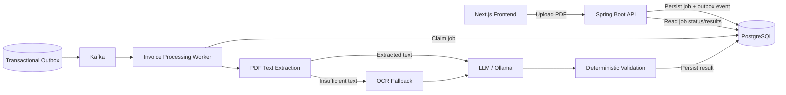
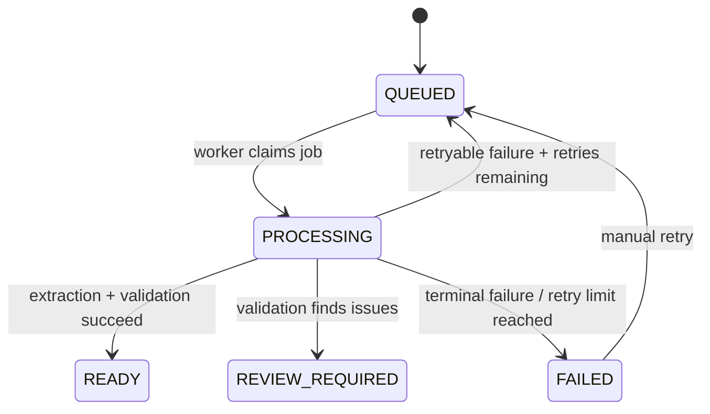

# Invoice Intelligence

An asynchronous invoice-processing platform built with Java and Spring Boot that turns PDF invoices into structured, validated data.

The system combines document extraction, OCR, and LLM-based interpretation with deterministic business validation. The interesting part is the processing infrastructure around the AI workload: transactional outbox, at-least-once delivery, concurrent database-backed job claiming, leases, fenced completion, automatic retry, and explicit manual retry.

## What it does

Upload a PDF invoice and the platform:

1. Creates a durable processing job.
2. Stores the PDF.
3. Publishes an `InvoiceProcessingRequested` event through a transactional outbox.
4. Extracts text from the document.
5. Falls back to OCR when normal PDF text extraction is insufficient.
6. Sends extracted content to an LLM for structured invoice interpretation.
7. Validates the extracted invoice deterministically in Java.
8. Produces one of three terminal outcomes:
    - `READY`
    - `REVIEW_REQUIRED`
    - `FAILED`

The frontend provides a thin presentation layer over the real backend APIs, including processing status, validation results, invoice details, line items, totals, and technical job information.

## Quick start (Docker)

Docker is the primary local quick-start for this repository.

Start the full development stack (PostgreSQL, Kafka, backend, frontend):

```bash
docker compose up --build
```

- Frontend: http://localhost:3000
- Backend:  http://localhost:8080

What Compose starts (local development):

- PostgreSQL 15 (service name: `db`, exposed on host: `localhost:5432`) — database: `invoice_intelligence`, user: `invoice`, password: `invoice`.
- Apache Kafka 4.x in KRaft mode (service name: `kafka`) — container networking: `kafka:9092`; host access for tools is available at `localhost:29092`.
- Spring Boot backend (built with the project's Gradle wrapper on Java 21) — listens on port 8080.
- Next.js frontend (production standalone build) — listens on port 3000.

Important notes:

- Kafka is configured in KRaft mode in docker-compose.yml.
- The backend uses the environment variable `SPRING_KAFKA_BOOTSTRAP_SERVERS` (compose sets `kafka:9092`) so containers talk to Kafka via `kafka:9092`.
- Ollama (the local LLM runtime) is intentionally NOT included in docker compose. The application configuration expects Ollama at `http://localhost:11434` by default and the configured model in this repository is `gemma3:12b` (see `src/main/resources/application.yml`). Start Ollama locally if you need the LLM extraction path.
- To reset the local development database/state (destroys PostgreSQL volume):

```bash
docker compose down -v
```

(Optional) If you only want to rebuild a single service:

```bash
docker compose build backend
docker compose up -d backend
```

(See the Dockerfile for exact build/runtime behavior of each service.)


## Architecture



PostgreSQL is the authoritative source of job state. Kafka is used for asynchronous delivery and triggering work; it is not the source of truth for processing state.

## End-to-end processing flow

```text
Client
  |
  | POST /api/v1/documents
  v
Create Job
  |
  +--> PostgreSQL: job = QUEUED
  |
  +--> PostgreSQL: outbox event
             |
             v
        Outbox Publisher
             |
             v
           Kafka
             |
             v
      Processing Consumer
             |
             v
       Claim QUEUED Job
             |
             v
         PROCESSING
             |
             +--> PDF text extraction
             |       |
             |       +--> enough text --> continue
             |       |
             |       +--> insufficient --> OCR
             |
             v
       LLM extraction
             |
             v
   Deterministic validation
             |
             +--> valid ------> READY
             |
             +--> issues -----> REVIEW_REQUIRED
             |
             +--> terminal failure -> FAILED
```

## Reliability model

The project is deliberately designed around the fact that asynchronous processing can fail at every boundary.

### Transactional outbox

Job creation and the corresponding processing event are persisted in the same database transaction.

```text
BEGIN
  INSERT processing_job
  INSERT outbox_event
COMMIT
```

The application does not perform:

```text
INSERT job
publish Kafka event
```

as two independent operations.

If the transaction commits, the event is durable and can be published later by the outbox publisher.

### At-least-once delivery

Outbox publication is intentionally at-least-once.

A publisher can successfully send an event to Kafka and fail before recording the event as published. The same event may therefore be published again.

The consumer is designed around this reality rather than assuming exactly-once delivery.

### Concurrent job claiming

Workers claim queued jobs using PostgreSQL row locking with:

```sql
FOR UPDATE SKIP LOCKED
```

This allows multiple workers to safely compete for work without blocking on rows already claimed by another worker.

The claim operation changes the job to `PROCESSING` and assigns a unique `processing_attempt_id`.

### Leases

A processing attempt has a lease.

If a worker crashes or becomes stuck after claiming a job, the lease can expire and the job can be recovered.

This prevents a permanently abandoned `PROCESSING` job.

### Fenced completion

Every processing attempt receives a unique attempt identifier.

Completion, retry, and failure updates are conditional on both:

```text
status = PROCESSING
processing_attempt_id = current attempt
```

An old worker therefore cannot overwrite the result of a newer worker after its lease has expired and the job has been reclaimed.

### Automatic retry

Transient processing failures can return a job to `QUEUED` while the automatic retry limit has not been reached.

After the retry limit is exhausted, the job becomes `FAILED`.

### Manual retry

A terminal `FAILED` job can be retried explicitly through the API.

Manual retry performs:

```text
FAILED
  |
  v
QUEUED
  |
  +--> durable InvoiceProcessingRequested outbox event
```

The retry state transition and event creation are committed in the same transaction, preserving the transactional-outbox guarantee.

## Processing lifecycle



## AI and document pipeline

The AI component is deliberately treated as an untrusted interpreter rather than the authority for business correctness.

### Document extraction

The pipeline first attempts normal PDF text extraction.

For scanned or image-based invoices where extracted text is insufficient, the system falls back to OCR.

OCR is isolated from the normal test JVM because native OCR dependencies can behave differently from ordinary Java tests.

### LLM extraction

The LLM receives extracted document content and produces structured invoice information.

The LLM is responsible for interpretation:

```text
PDF content -> structured invoice fields
```

It is not responsible for deciding whether those fields are mathematically or commercially valid.

### Deterministic validation

Java performs deterministic checks on the extracted data.

Examples include:

- required fields
- invoice totals
- subtotal calculations
- tax calculations
- line-item arithmetic
- consistency between extracted values

This creates a clear boundary:

```text
LLM
  |
  | interpretation
  v
Structured invoice
  |
  | deterministic business validation
  v
Validated result
```

An LLM response is therefore never treated as inherently trustworthy just because the model produced it.

## Domain model

The core aggregate is `InvoiceProcessingJob`.

The job owns the processing lifecycle and protects the valid state transitions.

The invoice result contains domain concepts such as:

- `Invoice`
- `InvoiceLineItem`
- `Party`
- `TaxBreakdown`
- validation results
- validation issues

The processing state is represented in the domain layer so application and infrastructure code depend on domain concepts rather than the other way around.

### DDD decisions

The project uses a focused set of Domain-Driven Design concepts rather than attempting to model every class as a domain object.

**Aggregate Root**

`InvoiceProcessingJob` is the aggregate root because processing state, retry behavior, and attempt ownership need a single consistency boundary.

**Value-oriented domain data**

Invoice concepts such as parties, tax breakdowns, and line items represent domain information rather than infrastructure concerns.

**Application services**

Application services orchestrate use cases such as job creation, queue management, processing, and retrieval. They coordinate repositories and external ports without moving infrastructure concerns into the domain model.

**Ports and adapters**

External concerns such as document storage, OCR, LLM extraction, event publishing, and persistence are represented behind application/domain-facing interfaces and implemented by infrastructure adapters.

## Persistence

PostgreSQL stores the authoritative processing state.

The persistence model includes information required for:

- invoice processing jobs
- processing attempts
- invoice results
- validation results
- outbox events
- timestamps and leases

JPA/Hibernate is used for persistence while the domain model remains separate from the persistence entities.

The database is intentionally involved in concurrency control rather than relying only on in-memory synchronization.

## API

### Upload an invoice

```http
POST /api/v1/documents
Content-Type: multipart/form-data
```

The endpoint accepts a PDF document and returns a processing job.

### Get a job

```http
GET /api/v1/documents/{jobId}
```

Returns processing status and, when available, the extracted invoice and validation result.

### List jobs

```http
GET /api/v1/documents
```

Returns invoice-processing job summaries, newest first.

### Retry a failed job

```http
POST /api/v1/documents/{jobId}/retry
```

Moves a `FAILED` job back to `QUEUED` and creates a durable processing event through the transactional outbox.

## Technology stack

### Backend

- Java 21
- Spring Boot 4.1.1
- Spring Data JPA / Hibernate
- Gradle
- PostgreSQL
- Apache Kafka
- PDFBox
- Tess4J / Tesseract
- Ollama
- Jackson

### Frontend

- Next.js
- React
- TypeScript
- Tailwind CSS

## Local development without Docker

### Prerequisites

Install:

- Java 21
- Gradle or use the Gradle wrapper
- PostgreSQL
- Kafka
- Ollama
- Node.js

The frontend requires a recent Node.js release compatible with the current Next.js project.

### PostgreSQL

Create the application database and user using an administrative PostgreSQL account.

For example:

```sql
CREATE USER invoice WITH PASSWORD 'invoice';
CREATE DATABASE invoice_intelligence OWNER invoice;
```

Configure the application datasource in:

```text
src/main/resources/application.yml
```

The test suite uses a separate database configured in:

```text
src/test/resources/application-test.yml
```

This prevents normal integration tests from writing to the development database.

### Kafka

Start a local Kafka broker.

The application expects Kafka to be available according to the broker configuration in `application.yml`.

### Ollama

Start Ollama and make the configured model available locally.

The application uses Ollama through its HTTP API for invoice extraction.

### Run the backend

```bash
./gradlew bootRun
```

### Run the frontend

```bash
cd frontend
npm install
npm run dev
```

The frontend is available at:

```text
http://localhost:3000
```

The backend is available at:

```text
http://localhost:8080
```

## Testing

The standard test suite covers the application without requiring a running Ollama instance or native OCR execution.

Run:

```bash
./gradlew test
```

OCR integration tests are isolated because Tesseract/native dependencies can terminate the JVM independently of ordinary Java test failures.

Run OCR integration tests with:

```bash
./gradlew ocrTest
```

Ollama-tagged tests can be enabled explicitly with:

```bash
./gradlew test -Pollama
```

The test database is separate from the normal development database.

The project intentionally does not optimize for a coverage percentage. Tests focus on behavioral and architectural correctness, particularly around:

- job lifecycle transitions
- concurrent claiming
- retry behavior
- processing-attempt fencing
- lease recovery
- transactional outbox behavior
- deterministic validation
- document/OCR boundaries

## Example workflow

Upload a PDF:

```bash
curl -X POST \
  -F "file=@invoice.pdf" \
  http://localhost:8080/api/v1/documents
```

The response provides the processing job ID.

Then query:

```bash
curl \
  http://localhost:8080/api/v1/documents/{jobId}
```

A job may progress through:

```text
QUEUED
PROCESSING
READY
```

or:

```text
QUEUED
PROCESSING
REVIEW_REQUIRED
```

or, after terminal failure:

```text
QUEUED
PROCESSING
FAILED
```

A failed job can be manually retried:

```bash
curl -X POST \
  http://localhost:8080/api/v1/documents/{jobId}/retry
```

## Scope

This project intentionally focuses on demonstrating production-oriented backend engineering around asynchronous AI document processing.

It does not attempt to be a complete enterprise invoice platform.

Out of scope for the current implementation:

- multi-tenant authorization
- enterprise identity management
- cloud deployment automation
- distributed tracing infrastructure
- billing
- human approval workflows
- arbitrary document formats beyond PDF invoices
- model training or fine-tuning

Possible future extensions include:

- object storage such as GCS/S3
- cloud-managed Kafka
- OpenTelemetry tracing
- authentication and multi-tenancy
- richer human-review workflows
- production deployment manifests
- additional document types

## Why this project exists

The project is designed to demonstrate a specific engineering idea:

> AI extraction is only one part of a reliable AI application.

The harder engineering problems are often around the AI boundary:

- What happens when processing fails?
- What happens when a worker crashes?
- What happens when a message is delivered twice?
- What happens when a lease expires?
- What happens when an old worker finishes after another worker has reclaimed the job?
- What happens when an LLM returns structurally valid but mathematically incorrect data?

Invoice Intelligence answers those questions with explicit persistence, concurrency, retry, and validation mechanisms rather than relying on optimistic assumptions about external systems.

## Docker implementation

- Backend Dockerfile: builds the Spring Boot fat JAR using the project's Gradle wrapper (the image uses Java 21) and runs the JAR on port 8080. See `Dockerfile` at the repository root for exact build steps.

- Frontend Dockerfile: performs a multi-stage Next.js production build (`npm ci` + `npm run build`) and runs the Next.js standalone output (`server.js`) on port 3000. See `frontend/Dockerfile` for exact details.

These Dockerfiles are intended for local development and a quick, reproducible environment — they are not optimized for production deployment.

