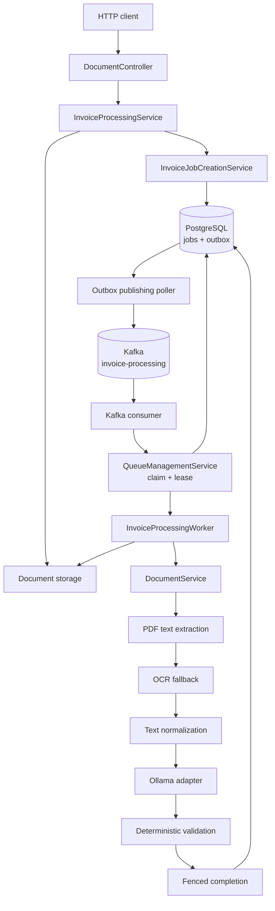
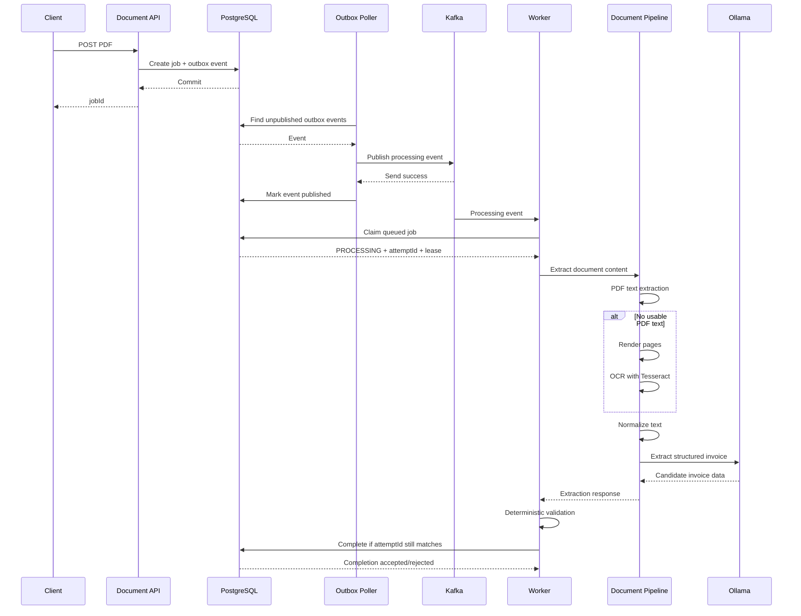
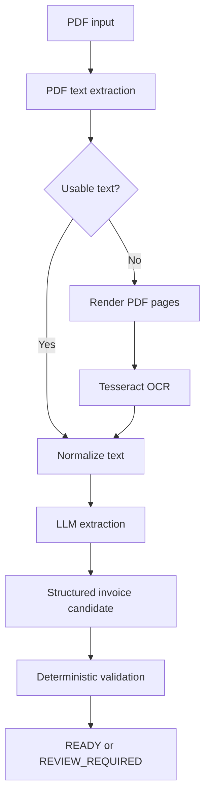

# Invoice Intelligence — Architecture

## 1. Purpose

Invoice Intelligence is a portfolio implementation of reliable asynchronous document processing.

The system accepts PDF invoices, extracts document content, uses an LLM to interpret invoice fields, validates the extracted result deterministically, and persists the final processing state.

The architecture deliberately separates:

- **Document interpretation** — PDF extraction, OCR, and LLM extraction.
- **Business validation** — deterministic Java/domain rules.
- **Processing reliability** — durable jobs, transactional outbox, Kafka delivery, database claiming, leases, retries, and stale-worker fencing.

The goal is to demonstrate how an AI-assisted backend can remain predictable when the AI output is incomplete or when distributed processing fails.

---

## 2. Architectural boundaries

The application follows a practical layered/hexagonal structure.

### Domain

The domain owns business state and rules:

- `InvoiceProcessingJob`
- invoice model
- invoice line items
- parties
- tax breakdowns
- validation results
- processing lifecycle
- repository/port contracts
- outbox event model

The domain does not depend on Spring, Kafka, PostgreSQL, PDFBox, Tess4J, or Ollama.

### Application

The application layer coordinates use cases and workflows:

- document submission
- job creation
- outbox publication
- queue claiming
- lease recovery
- invoice processing
- document extraction orchestration

External capabilities are accessed through application ports such as:

- document storage
- invoice extraction
- document text extraction
- page rendering/image extraction
- event publishing
- processing ownership

### Infrastructure

Infrastructure implements the application ports using concrete technologies:

- PostgreSQL
- Spring Data JPA / Hibernate
- Kafka
- local file storage
- PDFBox
- Tess4J / Tesseract
- Ollama over HTTP
- Spring scheduling

This keeps infrastructure replaceable without putting infrastructure concerns into the domain model.

---

## 3. High-level architecture

The presentation layer is a thin Next.js frontend over the backend APIs. It displays the processing queue, current job state, validation results, invoice details, and technical job metadata; it does not own processing state or business rules.




PostgreSQL is the authoritative source for the durable processing lifecycle.

Kafka is used to deliver processing requests. It is not the source of truth for whether an invoice is currently queued, processing, completed, or failed.

---

## 4. End-to-end processing sequence



### Important transactional boundary

Job creation and outbox creation happen in the same database transaction.

Therefore:

```text
Transaction
 ├── create processing job
 └── create outbox event
       ↓
     COMMIT
```

A rollback cannot leave a job without its corresponding processing request.

Kafka publication happens later and is therefore intentionally outside that transaction.

---

## 5. Job lifecycle

The processing lifecycle is:

```text
QUEUED
   |
   v
PROCESSING
   |
   +------> READY
   |
   +------> REVIEW_REQUIRED
   |
   +------> FAILED
                |
                | explicit retry
                v
              QUEUED
```

### `QUEUED`

The job is durable and waiting for processing.

### `PROCESSING`

A worker has successfully claimed the job.

The claim records:

- processing attempt ID
- lease expiration
- processing state

### `READY`

Processing completed and deterministic validation considers the extracted invoice valid.

### `REVIEW_REQUIRED`

Processing completed, but validation found missing or inconsistent information that requires attention.

This is deliberately different from an operational processing failure.

### `FAILED`

Processing exhausted the configured automatic retry limit or reached a terminal operational failure.

A failed job can be explicitly moved back to `QUEUED` through the retry API.

---

## 6. Transactional outbox

The system uses the transactional outbox pattern to avoid a split between database state and message publication.

Without an outbox, the application could do:

```text
1. Save job
2. Publish Kafka message
```

If step 1 succeeds and step 2 fails, the job exists but no processing message exists.

Or:

```text
1. Publish Kafka message
2. Save job
```

If the database transaction fails, Kafka may contain a request for a job that was never committed.

The outbox changes this to:

```text
Database transaction
 ├── Job
 └── Outbox event
       |
       | later
       v
    Kafka
```

The outbox poller finds unpublished records, publishes them, and records `publishedAt` only after successful publication.

### At-least-once consequence

There is an intentional failure window:

```text
Kafka publish succeeds
        |
        X
        |
DB mark-published fails
```

On the next poll, the same outbox event can be published again.

Therefore the system assumes **at-least-once delivery**, not exactly-once delivery.

This is acceptable because message uniqueness is not used as the correctness mechanism. The authoritative job record is claimed transactionally from PostgreSQL.

---

## 7. Concurrent job claiming

Multiple workers can process jobs concurrently.

The claim operation uses PostgreSQL row locking with:

```sql
FOR UPDATE SKIP LOCKED
```

Conceptually:

```text
Worker A ──┐
           ├──> PostgreSQL
Worker B ──┘
```

If Worker A locks one queued row, Worker B can skip that locked row and claim another queued row rather than waiting for the first worker.

The claim transaction changes the job from:

```text
QUEUED
   ↓
PROCESSING
```

and assigns a unique processing attempt ID.

This prevents two workers from simultaneously becoming the owner of the same queued job.

---

## 8. Leases and abandoned workers

A worker can disappear after claiming a job.

Examples:

- JVM crash
- machine failure
- process termination
- network failure
- worker becoming unavailable

Without recovery, the job could remain permanently stuck in `PROCESSING`.

The claim therefore includes a lease expiration.

Current timing relationship:

```text
Ollama HTTP timeout      ≈ 4 minutes
Processing lease         ≈ 5 minutes
Kafka max poll interval  ≈ 6 minutes
```

The lease recovery poller finds expired processing jobs and makes them eligible for processing again.

The design intentionally avoids lease renewal for the current portfolio scope.

---

## 9. Stale-worker fencing

Lease recovery creates an important race.

Consider:

```text
Worker A claims job
        |
        | lease expires
        v
Recovery requeues job
        |
        v
Worker B claims job
        |
        v
Worker A finishes late
```

Worker A must not be allowed to overwrite Worker B's newer result.

The solution is a unique `processingAttemptId`.

Each claim receives a new attempt ID:

```text
Job
 ├── attempt A
 └── attempt B
```

Completion and failure operations are conditional on both:

```text
status = PROCESSING
AND processing_attempt_id = currentAttemptId
```

Therefore:

```text
Worker A completion
attempt = A
        |
        X
        |
DB currently owns attempt B
```

The update affects zero rows and the stale result is discarded.

This is a **fencing-token style concurrency control** mechanism.

---

## 10. Failure and retry model

Processing exceptions are treated as operational failures.

The worker asks the ownership component to retry or permanently fail the current attempt.

The current automatic retry limit is three attempts.

Conceptually:

```text
Processing failure
       |
       v
retryCount < limit?
   /            yes            no
  |              |
  v              v
QUEUED         FAILED
```

The retry/failure update is also fenced by the processing attempt ID.

A stale worker therefore cannot increment retries or fail a job after ownership has moved to another attempt.

### Manual retry

Manual retry is intentionally separate from automatic retry:

```text
FAILED
  |
  v
QUEUED
  |
  +--> InvoiceProcessingRequested outbox event
```

The `FAILED -> QUEUED` state transition and the corresponding outbox event are persisted in the same database transaction.

The retry endpoint does not retry an already successful or reviewable job.

---

## 11. Kafka acknowledgement model

Kafka consumer offset handling is deliberately explicit.

Automatic consumer commits are disabled.

The consumer acknowledges a record only when the processing outcome is considered handled.

### Retryable processing failure

The record is negatively acknowledged so Kafka can redeliver it.

### Completed processing

The record is acknowledged.

### Terminal failure

The record is acknowledged because the processing attempt has reached its terminal state.

### Stale worker result

The record is acknowledged because the stale result has been safely discarded.

The important distinction is:

```text
Kafka acknowledgement
        ≠
invoice business state
```

Kafka controls message delivery. PostgreSQL controls durable job ownership and state.

---

## 12. Document processing pipeline

The document pipeline intentionally uses a fallback strategy.



### PDF extraction

PDFBox first attempts to extract embedded/selectable text.

This is the cheapest path for normal digital invoices.

### OCR fallback

If no usable text is present:

1. PDF pages are rendered at 200 DPI.
2. The rendered images are passed through Tesseract using Tess4J.
3. OCR output is returned to the document pipeline.

The current API accepts PDF documents only. OCR handles scanned content **inside those PDFs**.

### Text normalization

Whitespace and line endings are normalized before the extracted content is sent to the LLM.

This gives the extraction layer a more consistent input regardless of whether text came from PDFBox or OCR.

---

## 13. LLM boundary

The LLM is deliberately treated as an interpretation component rather than a source of business truth.

The flow is:

```text
Document
   ↓
Extracted text
   ↓
LLM
   ↓
Candidate invoice
   ↓
Deterministic validation
   ↓
Business result
```

The application depends on an `InvoiceExtractor` port.

The Ollama HTTP client is an infrastructure implementation of that port.

This means the core processing workflow does not need to know:

- Ollama HTTP details
- request/response DTOs
- HTTP configuration
- model-specific client behavior

A different extraction implementation could be introduced behind the same port without changing the domain validation rules.

---

## 14. Deterministic validation

LLM extraction is inherently probabilistic.

The system therefore does not trust the model to determine whether the invoice is internally consistent.

Java performs deterministic checks over the extracted domain model.

Examples include:

- required invoice fields
- line-item consistency
- subtotal arithmetic
- tax-inclusive totals
- missing information
- discrepancies

The result is represented explicitly as validation state/issues.

This produces two different classes of outcome:

```text
Extraction succeeded
        |
        +--> VALID
        |      |
        |      v
        |    READY
        |
        +--> INVALID / inconsistent
               |
               v
        REVIEW_REQUIRED
```

An invoice requiring review is therefore not the same thing as a failed processing attempt.

---

## 15. Domain-driven design decisions

The project uses selected **DDD** concepts where they improve correctness.

### Aggregate root

`InvoiceProcessingJob` acts as the aggregate root for processing lifecycle state.

Operations such as completion and state transitions are expressed through the job's domain behavior rather than allowing arbitrary external mutation.

### Value-oriented domain objects

Invoice concepts such as parties, tax information, validation results, and line items are represented as domain objects rather than passing raw infrastructure DTOs through the business workflow.

### Ports and adapters

The application defines ports for capabilities such as storage, extraction, publishing, and processing ownership.

Infrastructure implements those ports.

The important architectural rule is:

```text
Domain
  ↑
Application
  ↑
Infrastructure
```

Dependencies point inward toward business concepts rather than outward toward frameworks and infrastructure.

---

## 16. Persistence model

PostgreSQL is the authoritative persistence layer.

The job record stores durable processing information including:

- job identity
- document reference
- processing status
- retry count
- lease information
- processing attempt ID
- extracted invoice data
- validation result
- timestamps

JSONB is used for structured invoice and validation data where the domain object is naturally document-shaped.

JPA/Hibernate handles persistence mapping, while transactional boundaries are controlled by the application/service layer.

---

## 17. Correctness under failure

The key failure scenarios are designed explicitly.

| Failure | Result |
|---|---|
| Database transaction rolls back | Job and outbox event are both rolled back |
| Kafka temporarily unavailable | Unpublished outbox event remains durable |
| Kafka publish succeeds but outbox update fails | Event may be published again |
| Two workers claim simultaneously | Database locking prevents double ownership |
| Worker dies during processing | Lease recovery can requeue the job |
| Old worker finishes after recovery | Attempt-ID fencing rejects stale completion |
| Processing fails before retry limit | Job is retried |
| Processing reaches retry limit | Job becomes `FAILED` |
| Extracted invoice is inconsistent | Job becomes `REVIEW_REQUIRED`, not operational failure |
| Manual retry requested for non-FAILED job | Request is rejected |

The architecture therefore treats failure as part of the normal processing model rather than as an exceptional afterthought.

---

## 18. Why PostgreSQL remains authoritative

Kafka is intentionally not used as the job database.

The system needs transactional state for:

- ownership
- leases
- retries
- attempt IDs
- validation results
- final job state

These operations require conditional database updates and transactional locking.

Kafka is therefore used for what it does well here:

```text
durable event delivery
        +
consumer-driven processing
```

PostgreSQL handles:

```text
authoritative state
        +
ownership
        +
concurrency control
```

---

## 19. Technology choices

| Concern | Technology |
|---|---|
| Language | Java 21 |
| Application framework | Spring Boot |
| API | Spring Web |
| Persistence | PostgreSQL + Spring Data JPA / Hibernate |
| Messaging | Apache Kafka |
| Document text | Apache PDFBox |
| OCR | Tess4J / Tesseract |
| LLM | Ollama |
| HTTP client | Spring `RestClient` |
| Build | Gradle |
| Testing | JUnit 5, Mockito, AssertJ, Awaitility |

The choices are intentionally conventional for a backend portfolio project: the interesting part is the interaction between these components and the reliability guarantees around them.

---

## 20. Deliberate scope boundaries

The project is intentionally not a complete production SaaS platform.

The current implementation does not attempt to solve:

- authentication and authorization
- managed object storage
- malware/AV scanning
- database migration deployment
- production secrets management
- application containerization
- distributed tracing
- production alerting
- dead-letter queue infrastructure
- workflow-engine orchestration
- exactly-once Kafka processing
- model evaluation infrastructure
- advanced OCR preprocessing

These are possible production hardening steps, but adding them would not materially improve the core portfolio demonstration.

The core demonstration is:

> **Can an AI-assisted document-processing workflow remain deterministic and recoverable when the AI is uncertain and distributed processing fails?**

The architecture is designed around that question.
