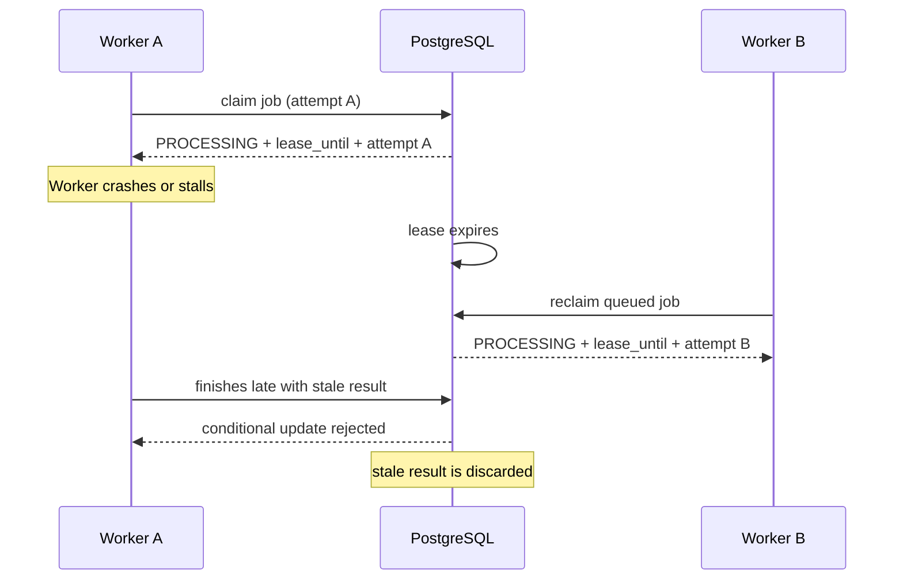
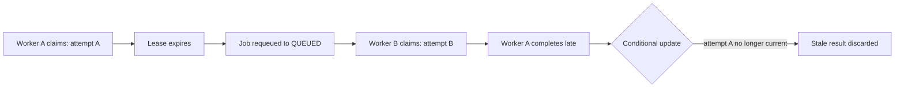

# Invoice Intelligence — Reliable Asynchronous AI Processing

## Overview

Invoice Intelligence is an asynchronous invoice-processing platform built with Java and Spring Boot. It accepts PDF invoices, extracts document text, falls back to OCR when needed, interprets the invoice with an LLM, and then validates the extracted data deterministically in Java before marking the job as ready or requiring review.

The central engineering challenge highlighted by this case study is not simply “integrating an LLM.” It is reliable asynchronous job processing: jobs must be claimed safely, recovered when workers stall, retried without duplicate correctness issues, and fenced against stale workers that finish after another worker has already taken over.

## The concurrency problem

The failure scenario is straightforward and common in asynchronous work queues:

- A worker claims a job.
- The worker crashes or becomes stuck.
- The job must eventually be recoverable.
- A lease provides bounded processing ownership.
- After lease expiry, another worker can reclaim the job.
- The original worker may nevertheless finish later.
- Without fencing, that stale worker could overwrite newer state.

The core problem is not whether a job can be processed once; it is whether processing ownership can be recovered safely when the original worker disappears.



## Design

### Database-backed job claiming

The actual claim operation is backed by PostgreSQL row locking with `FOR UPDATE SKIP LOCKED`. When a queued job is selected, the transaction locks that row, prevents other workers from claiming the same row, and skips rows already locked by other transactions. The claim operation then transitions the job from `QUEUED` to `PROCESSING`, assigns a `processing_attempt_id`, sets `lease_until`, and persists the claim.

This is important because the row lock protects the claim transaction itself. It is not a lease that remains held for the duration of PDF extraction, OCR work, or LLM interpretation. The claim is a short coordination step; the processing continues asynchronously under the lease.

### Lease-based recovery

Each processing attempt stores a `lease_until` timestamp. Jobs that are still `PROCESSING` but whose lease has expired are identified by querying for rows where `status = 'PROCESSING'` and `lease_until <= :now`. Those jobs are then requeued to `QUEUED` so another worker can reclaim them. This allows a job to be recovered after a crash or after a worker simply stops making progress.

### Fencing stale workers

The actual fencing token is `processing_attempt_id`. Each worker receives a unique attempt ID when it claims the job. Later writes are not unconditional updates; they are conditional on matching the current attempt. The conceptual update is:

```sql
UPDATE ...
SET ...
WHERE id = :id
  AND status = 'PROCESSING'
  AND processing_attempt_id = :processingAttemptId
```

If the update affects zero rows, it means a newer worker has already claimed the job, and the stale worker’s result is discarded. This is the fence: the old worker cannot overwrite a newer processing attempt.

## The race condition

The core race is simple and must be treated as a correctness boundary:

Worker A claims with attempt A
→ lease expires
→ job is requeued
→ Worker B claims with attempt B
→ Worker A finishes late
→ Worker A's conditional update matches zero rows
→ stale result is discarded

This is the central visual explanation of the design:




## Retry semantics

The retry behavior is deliberately bounded and stateful:

- Automatic retry is triggered by a processing failure while the job is `PROCESSING`; when retries remain, the job is requeued to `QUEUED` and its retry count is incremented.
- If the automatic retry limit is reached, the job transitions to a terminal `FAILED` state.
- A manual retry is explicit: a `FAILED` job can be moved back to `QUEUED` and the retry count is incremented.
- Manual retry also creates an `InvoiceProcessingRequested` event through the transactional outbox, in the same transaction as the state change.

## AI and document-processing boundary

The actual processing boundary is clear: PDF text extraction happens first, then OCR fallback is used when required, then an LLM interprets the document, and finally Java code performs deterministic validation. The job ends in one of the final states: `READY`, `REVIEW_REQUIRED`, or `FAILED`.

This matters because the LLM is treated as an interpreter, not as the authority on business correctness. The deterministic Java validation layer enforces the actual invoice rules; the LLM provides extraction context, not final correctness.

## Why the design works

| Mechanism | Failure/problem addressed |
| --- | --- |
| FOR UPDATE SKIP LOCKED | Prevents concurrent workers from claiming the same queued job; only one worker wins the row lock. |
| Persistent PROCESSING state | Makes processing ownership explicit and recoverable in persistent storage rather than in-memory process state. |
| lease_until | Gives a bounded window for processing ownership; expired work can be requeued without manual intervention. |
| processing_attempt_id | Creates a stable attempt identity that can be used as a fencing token across retries and stale completion paths. |
| Conditional fenced updates | Prevents stale workers from overwriting newer state after a lease expires and a new worker claims the job. |
| Automatic retry limit | Caps how many times a processing failure can requeue before the job becomes terminally failed. |
| Transactional outbox | Ensures state changes and corresponding processing requests are committed together, preserving asynchronous delivery intent. |

## Evidence

The repository already contains tests that validate the important concurrency and recovery behaviors. The main evidence is in the queue-management and domain tests:

- `QueueManagementServiceIntegrationTest` validates single-winner job claiming, lease assignment, active lease protection, expired lease recovery, and retry/requeue behavior.
- `QueueManagementServiceConcurrencyIntegrationTest` validates that only one worker can claim the same queued job under concurrent access.
- `InvoiceProcessingJobTest` validates lease expiry transitions, requeue behavior, and invalid state transitions.

These tests cover the specific mechanisms described here: single-winner claiming, lease expiry handling, active lease protection, and retry/requeue semantics. They do not claim broader production-scale guarantees beyond the repository’s implemented behavior.

## Key takeaway

**A lease provides recovery; fencing provides safety.**

PostgreSQL coordinates processing ownership through row locking and persistent state. A lease allows abandoned work to be recovered after a worker stalls or crashes, while the attempt-ID fence prevents stale workers from corrupting newer state when they finish late. The result is a job-processing design that is recoverable, concurrency-safe, and consistent with the project’s explicit asynchronous-processing model.
